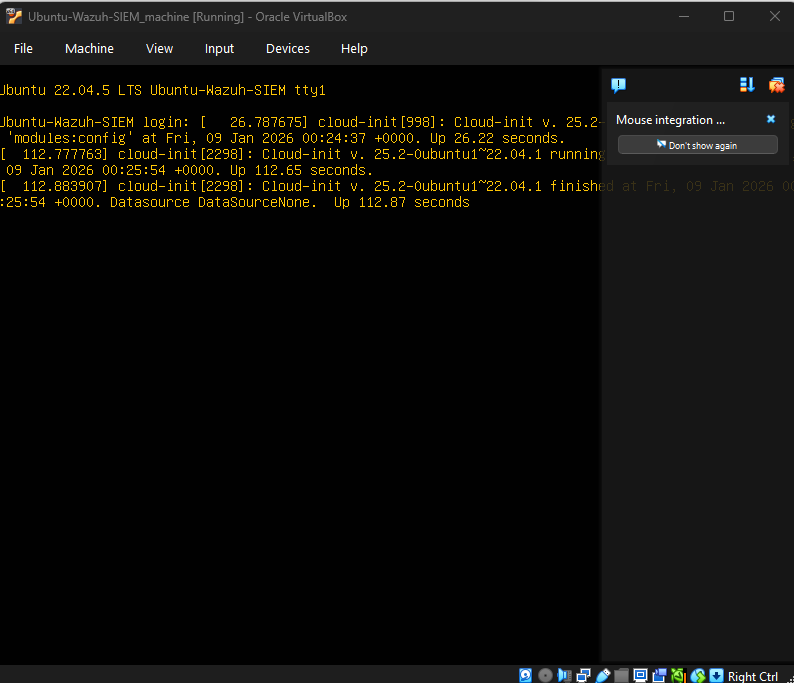
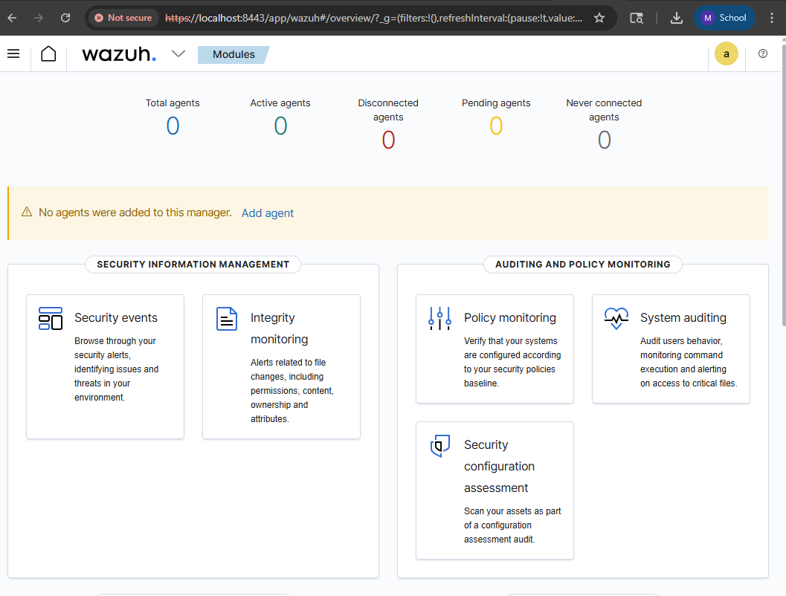
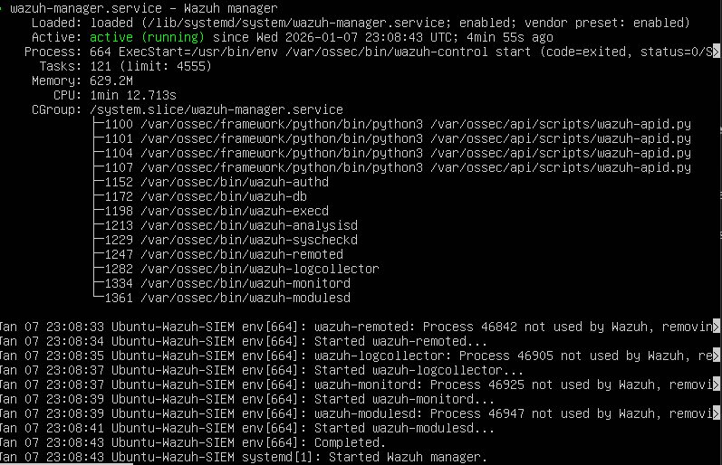
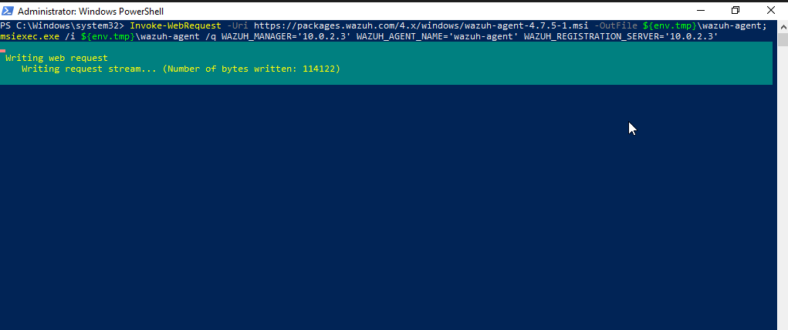
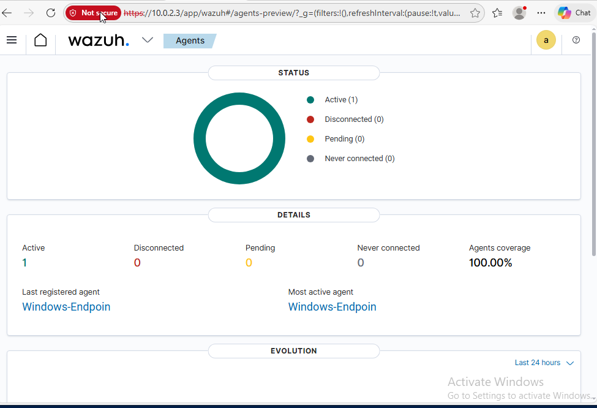
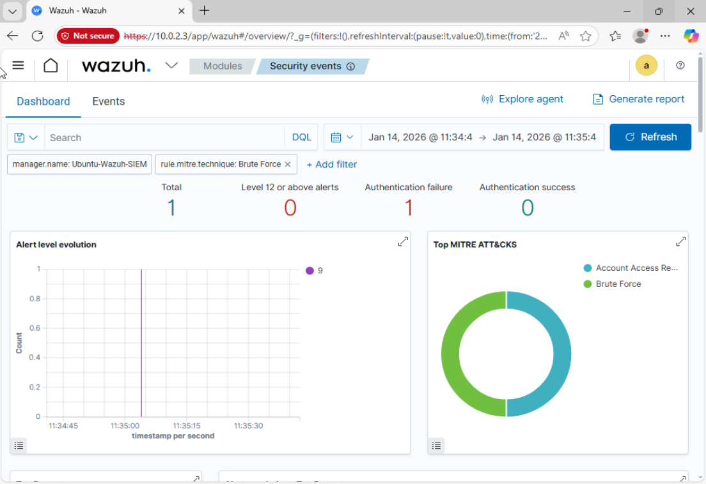
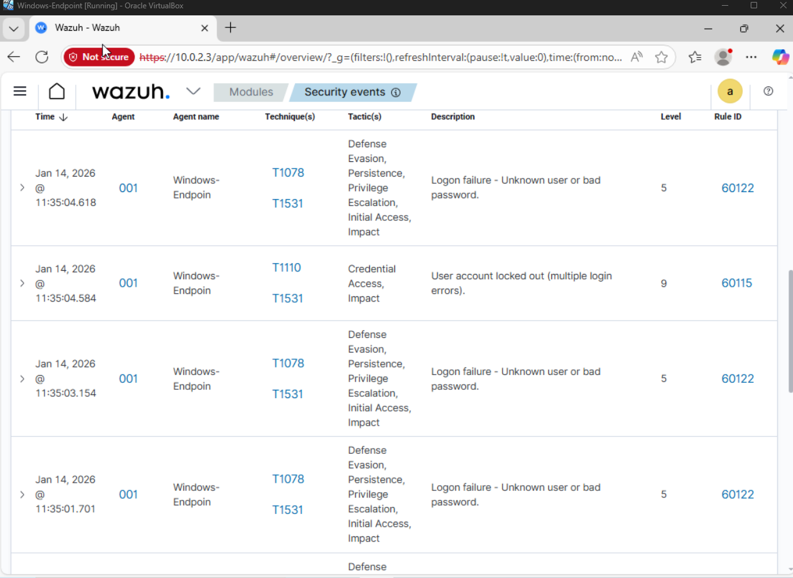

# SOC Detection & Monitoring Project

## Overview
This project documents the design, deployment, and validation of a small-scale Security Operations Center (SOC) lab using the **Wazuh SIEM** platform. The lab focuses on centralized log collection, endpoint monitoring, and foundational SOC operations using a Windows endpoint and a Linux-based SIEM server.

The goal of this project is to build practical, hands-on experience aligned with SOC analyst and cybersecurity internship roles.

---

## Objectives
- Deploy a functional SIEM platform
- Establish centralized security monitoring
- Onboard and monitor a Windows endpoint
- Verify agent connectivity and log ingestion
- Practice SOC-style troubleshooting and validation

---

## Lab Environment

### Host System
- **Operating System:** Windows
- **Virtualization Platform:** Oracle VirtualBox

### Virtual Machines
- **SIEM Server**
  - OS: Ubuntu Server 22.04 LTS
  - Role: Wazuh Manager, Indexer, Dashboard

- **Endpoint**
  - OS: Windows 10
  - Role: Monitored workstation running Wazuh agent

---

## Architecture
The lab uses a **shared NAT Network** within VirtualBox to allow secure communication between virtual machines while maintaining isolation from the host network.

- The Wazuh SIEM server and Windows endpoint reside on the same NAT Network
- The Wazuh dashboard is accessed from within the lab environment
- Agent communication occurs over standard Wazuh TCP ports (1514/1515)

This design prioritizes stability, simplicity, and security while supporting SOC functionality.

---

## Tools & Technologies
- Wazuh SIEM (Manager, Indexer, Dashboard)
- Ubuntu Server 22.04 LTS
- Windows 10
- Oracle VirtualBox
- PowerShell
- Linux system administration tools

---

## Implementation Summary

### SIEM Deployment
- Installed Ubuntu Server as the SIEM host

- Deployed the Wazuh all-in-one SIEM installation
- Verified core services (manager, indexer, dashboard)

- Confirmed dashboard accessibility

### Endpoint Onboarding
- Deployed a Windows 10 endpoint virtual machine
- Installed the Wazuh Windows agent using command-based enrollment

- Resolved agent configuration issues (manager address)
- Successfully started the Wazuh agent service
  

---

## Verification
- Wazuh Manager service confirmed running on the SIEM server
- Wazuh Dashboard accessible and functional
- Verified agent registration and active status in the Wazuh dashboard
- Windows endpoint appears as **Active** in the agent list
- Centralized log ingestion from the Windows endpoint verified

- 

--- 

## BRUTE FORCE ATTACK DETECTION REPORT

After multiple consecutive failed login attempts using random passwords against the same user account, the Wazuh agent successfully detected a brute force attack.
A total of 9 failed authentication attempts were recorded, resulting in an account lockout.

**Alert Name:** Brute Force Attack Attempt
**Date/Time:** 2026-01-14 19:35:04
**Affected Host:** Windows-VM
**Rule ID / Severity:** 60115 – Level 9
**MITRE ATT&CK Technique:** Brute Force (Credential Access)
**Description:** Multiple failed login attempts leading to user account lockout.

**Analyst Findings:**
Repeated logon failures due to invalid credentials were detected, indicating an attempted brute force attack against a valid user account. The account lockout mechanism successfully prevented unauthorized access.

**True/False Positive:** True Positive

**Recommended Action:**
Reset the affected user’s password, review the source of the login attempts, confirm the activity was unauthorized, and continue monitoring for further suspicious authentication activity.

- 
- 

---

## Challenges & Resolutions
Several challenges were encountered during setup, including:
- VirtualBox NAT vs. NAT Network communication limitations
- Dashboard accessibility after network changes
- Agent registration issues caused by incorrect manager configuration

These were resolved through:
- Migrating to a shared NAT Network for VM-to-VM communication
- Restarting Wazuh services in the correct order
- Correcting the Wazuh agent configuration on the Windows endpoint

These troubleshooting steps reflect real-world SOC deployment and maintenance tasks.

